<div align="center">

# 🔢 Calculadora Conversora en Python

**Conversor de números decimales a Binario, Octal y Hexadecimal**


</div>

---

## 📋 Tabla de Contenidos

- [Descripción](#-descripción)
- [Características](#-características)
- [Cómo funciona](#-cómo-funciona)
  - [Decimal a Binario](#decimal-a-binario-base-2)
  - [Decimal a Octal](#decimal-a-octal-base-8)
  - [Decimal a Hexadecimal](#decimal-a-hexadecimal-base-16)
- [Uso y Ejemplos](#-uso-y-ejemplos)

---

## 📖 Descripción

Este script de Python convierte números decimales enteros a sus representaciones en tres sistemas numéricos distintos: **binario**, **octal** y **hexadecimal**. Cada conversión está implementada manualmente usando el algoritmo de divisiones sucesivas, sin utilizar funciones nativas de Python como `bin()`, `oct()` o `hex()`.

---

## ✨ Características

- ✅ Conversión de decimal a **Binario** (base 2)
- ✅ Conversión de decimal a **Octal** (base 8)
- ✅ Conversión de decimal a **Hexadecimal** (base 16)
- ✅ Manejo del caso especial cuando el número es `0`
- ✅ Implementación manual del algoritmo (sin funciones nativas)
- ✅ Interfaz de entrada por consola

---

## ⚙️ Cómo funciona

### Decimal a Binario (Base 2)

Vista general del código de la función `dec_bin()`:

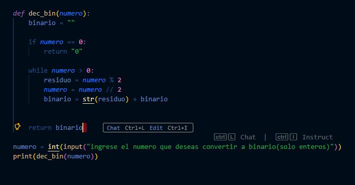

Se declara la función `dec_bin()` que recibe un número entero. Dentro de ella, primero se agrega la variable `numero` como parámetro y se inicializa `binario` como string vacío:

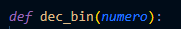

> 💡 La variable `binario` se declara como string vacío para poder concatenar los residuos directamente y construir el resultado de forma sencilla.

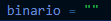

Después se maneja el caso especial: si el número ingresado es `0`, simplemente se retorna `"0"` de inmediato:

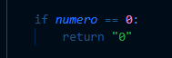

Ahora viene el cálculo principal. Se ejecuta un bucle `while` que corre mientras el número sea mayor a `0`. En cada iteración:
1. Se calcula el **residuo** con `% 2` — siempre retorna `0` o `1`
2. Se **actualiza el número** con división entera `// 2` para seguir dividiendo sin decimales
3. El residuo se **convierte a string** y se antepone a `binario` para que quede en el orden correcto al final

```python
while numero > 0:
    residuo = numero % 2
    numero = numero // 2
    binario = str(residuo) + binario
```

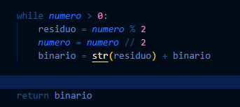

Para usar la función, se solicita el número con `input()` y se imprime el resultado:

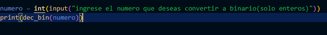

La salida en consola se ve así:

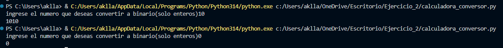

---

### Decimal a Octal (Base 8)

La lógica es **exactamente la misma** que para binario, con la única diferencia de que la base cambia de `2` a `8`. El operador `% 8` ahora retorna valores del `0` al `7`, y la división entera se realiza entre `8`:

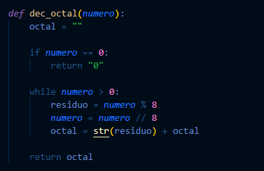

> 🔄 Mismo algoritmo, distinta base. Si entendiste binario, ¡ya entendiste octal!

---

### Decimal a Hexadecimal (Base 16)

Esta conversión tiene una particularidad: los valores del `10` al `15` se representan con letras (`A` al `F`). Para evitar múltiples condicionales, se declara una **cadena de caracteres** que mapea automáticamente cada posición con su símbolo:

```python
hexadecimal = "0123456789ABCDEF"
```


Así, si el residuo es `10`, `hexadecimal[10]` devuelve `'A'`; si es `14`, devuelve `'E'`, etc. El algoritmo usa `% 16` y `// 16`, y en esta función **no es necesario** manejar el caso especial del `0` porque ya está incluido como primer elemento de la cadena.

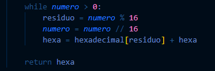

---

## 🚀 Uso y Ejemplos

Por último, se declara la variable `numero` con un `input()` fuera de cualquier función y se mandan a imprimir las tres conversiones:

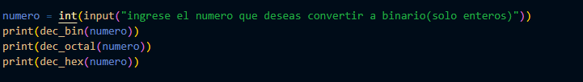

El resultado final del conversor con las tres salidas juntas se ve así:

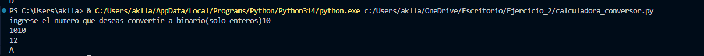

---

## 📁 Estructura del Proyecto

```
📦 calculadora-conversora/
├── 📄 calculadora_conversor.py   # Script principal
├── 📄 README.md                  # Documentación
└── 📁 assets/                    # Capturas de pantalla
    ├── 1.png
    ├── 2.png
    ├── ...
    └── 12.png
```

---

<div align="center">

Hecho con ❤️ en Python

</div>

