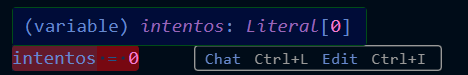
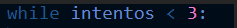
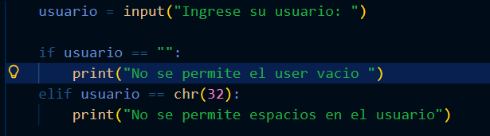
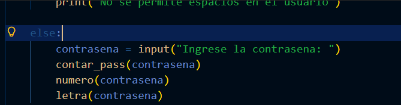
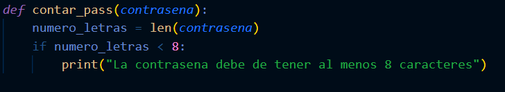
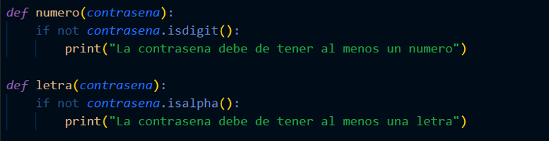
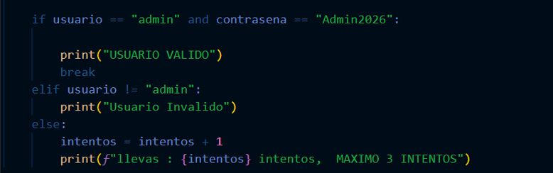
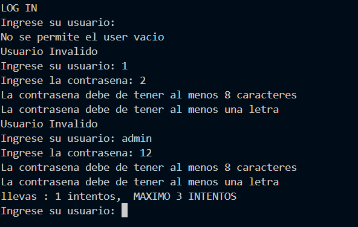
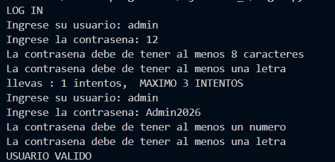

# 🔐 Login System en Python

> Sistema de autenticación en Python con validación de usuario, contraseña y límite de intentos.


---

## 📋 Descripción

Este programa implementa un sistema de **login por consola** que:

- Solicita usuario y contraseña al usuario
- Valida que los campos no estén vacíos ni contengan solo espacios
- Verifica que la contraseña cumpla con requisitos de seguridad
- Permite un **máximo de 3 intentos** antes de bloquear el acceso

---

## 🚀 Cómo ejecutar

```bash
python login.py
```

---

## 🧠 Explicación del Código

### 1️⃣ Variable de intentos

Primero se declara la variable `intentos = 0` que será usada para controlar el bucle `while`.



---

### 2️⃣ Bucle While

Se usa un `while` que se repite **mientras `intentos` sea menor a 3**, dando al usuario 3 oportunidades para ingresar correctamente.



---

### 3️⃣ Input del Usuario

Se declara la variable `usuario` como un `input()` para que el usuario ingrese su nombre de usuario.



---

### 4️⃣ Validación del Usuario (if / elif)

Se usa un `if` para **no permitir** que el usuario sea vacío (`""`) ni que contenga solo un espacio (`chr(32)`).


---

### 5️⃣ Else — Ingresar Contraseña

Si el usuario pasa las validaciones anteriores, se continúa al bloque `else` donde se solicita la contraseña y se llaman las funciones de validación.



---

### 6️⃣ Función: Longitud mínima

La función `contar_pass()` usa `len()` para contar los caracteres de la contraseña. Si tiene **menos de 8 caracteres**, imprime un mensaje de error.



---

### 7️⃣ Función: Número y Letra

Con `.isdigit()` e `.isalpha()` se verifica que la contraseña contenga **al menos un número** y **al menos una letra**.



---

### 8️⃣ Verificación de Credenciales

Tras las validaciones, se hace el `if` principal que comprueba si el **usuario y la contraseña** coinciden con los valores correctos.



---

### 9️⃣ Salida por Terminal

Si las credenciales son correctas, se imprime `USUARIO VALIDO` y el programa termina con `break`.



Al final, si todo falla, se acumulan los intentos y se muestra cuántos lleva el usuario.



---

## 🔒 Credenciales de Prueba

| Campo    | Valor      |
|----------|------------|
| Usuario  | `admin`    |
| Contraseña | `Admin2026` |

---

## 📁 Estructura del Proyecto

```
Ejercicio_3/
│
├── login.py
├── README.md
└── assets/
    ├── variableintetos.png
    ├── whileintentos.png
    ├── if_usuarios.png
    ├── elsecontrasena.png
    ├── defcontarpass.png
    ├── defnumerosydigitos.png
    ├── ifverificaruserycontrasena.png
    ├── salidaterminal.png
    └── salidaterminalfinal.png
```

---

## 🛠️ Tecnologías


---

## 👤 Autor 
Alan Alfonso Contreras Montalvo

Proyecto de práctica — **Lab de Programación** · Ejercicio 3
<div align="center">

Hecho con ❤️ en Python


</div>
